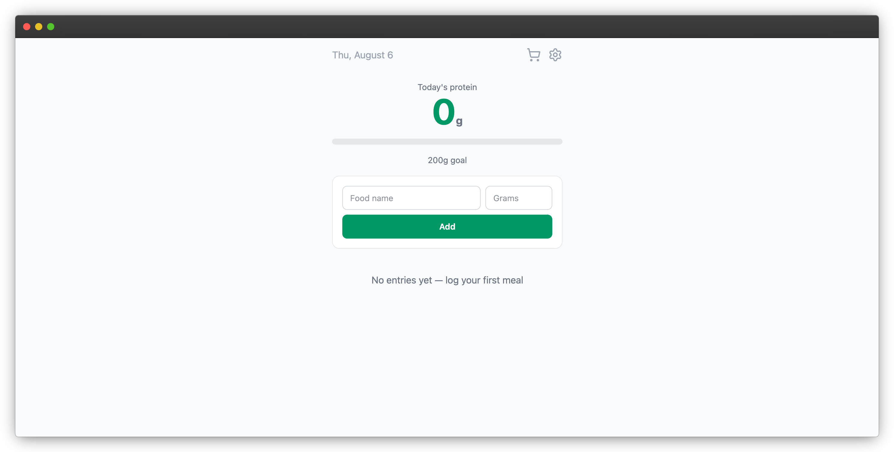

# Protein Tracker

A simple, fast daily protein tracker. Log what you eat, watch your total climb toward your goal, and pick up right where you left off — everything's saved locally in your browser.



## Features

- **Log entries** — food name + protein grams, logged with a timestamp
- **Daily goal + progress bar** — set a target in Settings and track progress at a glance
- **Delete a single entry** — remove a mistaken or duplicate log with one click
- **Edit an existing entry** — correct a food name or protein amount inline
- **Clear the whole log** — reset your day, with a confirmation step so it's not a one-click accident
- **Persistent storage** — entries and your goal are saved to `localStorage`, so refreshing the page (or closing the tab) doesn't lose your data
- **Input validation** — the form won't accept an empty food name or a zero/negative amount

## Tech stack

- [React](https://react.dev/) — UI and component state
- [Tailwind CSS v4](https://tailwindcss.com/) — styling, via the `@tailwindcss/vite` plugin
- [Vite](https://vitejs.dev/) — dev server and build tool
- [lucide-react](https://lucide.dev/) — icons (settings gear, delete trash icon)
- Browser `localStorage` — persistence, no backend required

## Getting started

Clone the repo and install dependencies:

```bash
git clone https://github.com/jrumbawa/protein-tracker.git
cd protein-tracker
npm install
```

Run the dev server:

```bash
npm run dev
```

Then open the local URL Vite prints in your terminal (usually `http://localhost:5173`).

## Usage

1. Type a food name and its protein content (in grams) into the input fields and hit **Add**.
2. Your running total and progress bar update immediately.
3. Click the **gear icon** to set or change your daily protein goal.
4. Edit an entry with its pencil icon, remove one with its trash icon, or clear the whole log with the **Clear Log** button (you'll be asked to confirm).
5. Everything persists automatically — close the tab and come back later, your log will still be there.

## Project structure

```
src/
  components/
    ProteinInput.jsx     # form for logging a new entry
    Log.jsx               # entry list + empty state
    ProgressBar.jsx       # goal progress bar
    SettingsIcon.jsx      # gear icon, opens settings
    SettingsModal.jsx     # set/edit daily protein goal
    ClearLogModal.jsx     # confirm before clearing the log
  App.jsx                  # state, persistence, layout
  main.jsx
```

## Possible next steps

- History / past-days view
- TypeScript
